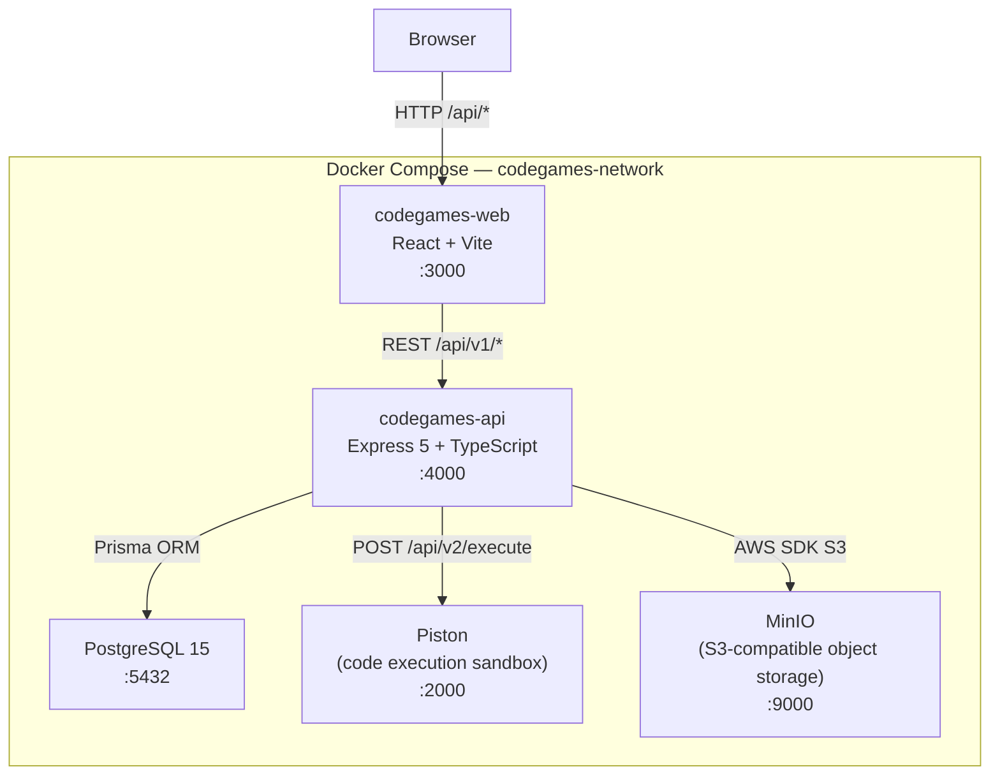
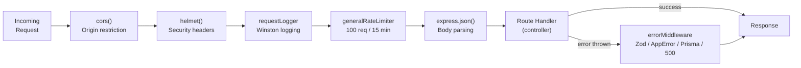
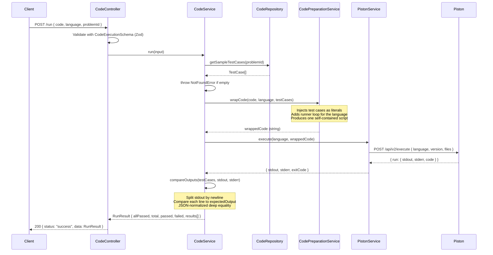
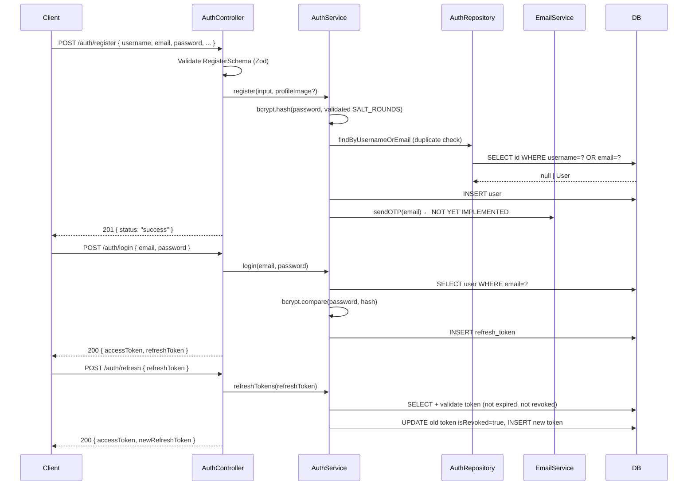
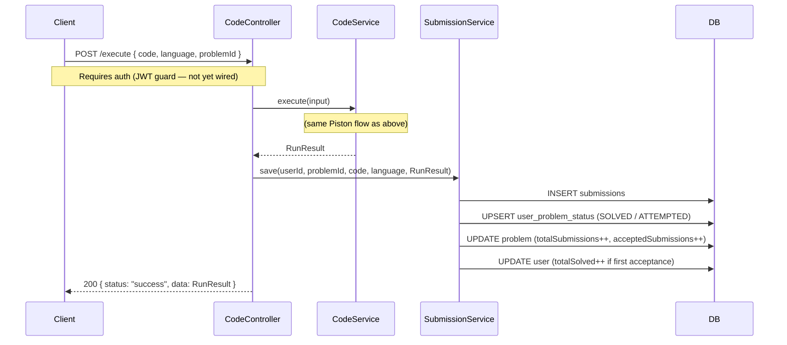
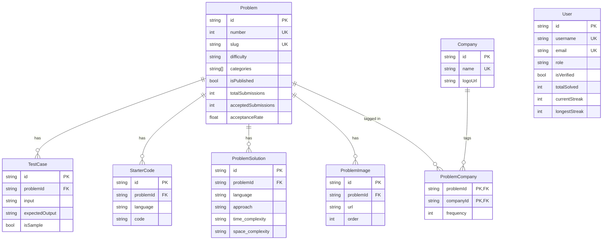
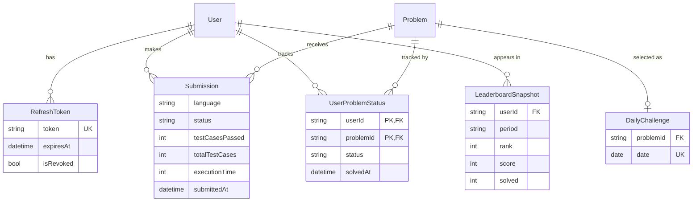

# CodeGames — Architecture

> System design, module responsibilities, and data flow diagrams.

---

## System Overview

CodeGames is currently composed of two applications and three infrastructure services, all orchestrated via Docker Compose.



**Startup order** (via `depends_on` + healthchecks):
1. `db` and `piston` start in parallel
2. `api` waits for both to be healthy
3. `web` waits for `api`

---

## API Module Breakdown

```
codegames-api/
├── auth/               # Registration (login/JWT planned)
├── code/               # Code execution via Piston
├── admin/
│   ├── problems/       # Problem CRUD
│   ├── test-cases/     # Test case management
│   └── starter-codes/  # Starter code management
├── user/               # Profile placeholder (not yet implemented)
├── upload/             # File upload to MinIO/S3
├── infrastructure/     # Express, Prisma, logger, env config
├── middleware/         # Error handling, rate limiting, request logging
└── shared/             # Error classes, types, test utilities
```

### Module Status

| Module | Status | What's Implemented | What's Missing |
|--------|--------|-------------------|----------------|
| `auth` | Partial | Register with validation, password hash, profile image | Login, JWT, refresh tokens, email OTP, logout, Google OAuth |
| `code` | Done | Run (sample tests) + Execute (all tests), 5 languages, Piston integration | Submission persistence, timing limits |
| `admin/problems` | Done | Full CRUD, search/filter by difficulty/category/published | Company/image/solution endpoints |
| `admin/test-cases` | Done | Get, add single, add bulk | — |
| `admin/starter-codes` | Done | Get, add single, add bulk | — |
| `user` | Stub | `findById()` only | All profile endpoints, stats, streaks |
| `upload` | Done | MinIO bucket setup, single/multi file upload | — |
| `infrastructure` | Done | Helmet, CORS, rate limiting, error handling, Zod env validation, Winston logger, validated config bootstrap | Auth guard wiring |
| `middleware` | Done | Error mapping, request logger, rate limiter | Auth guard (JWT verification) |
| `shared` | Done | Custom error classes, test utilities | — |

---

## Request Middleware Pipeline

Every incoming request passes through this chain before reaching a route handler:



Code execution routes additionally pass through `codeSubmissionRateLimiter` (10 req / min per IP) before the controller.

### Runtime configuration bootstrapping

Startup now follows this order:

1. `validateEnv(process.env)` parses and validates the environment
2. `initializeAppConfig(config)` stores the validated config once
3. infrastructure and feature services read config through `getAppConfig()`

This keeps runtime-sensitive services away from ad hoc `process.env` reads and avoids module-load ordering bugs.

---

## Code Execution Flow

This covers both `POST /run` (sample tests) and `POST /execute` (all tests).



### Code Wrapping (per language)

`CodePreparationService` generates a self-contained script per language. The test cases are embedded as hardcoded literals — no stdin/stdout piping is needed.

| Language | Harness approach |
|----------|-----------------|
| JavaScript | Test args spread into `solution(...)`, each result logged as JSON |
| Python | Test case JSON base64-encoded to avoid quote/newline escaping issues |
| Java | User code wrapped in a `Solution` class; args emitted as typed Java literals at wrap time, results serialized by a generated `__json` helper |
| C# | User code wrapped in a `Solution` class; typed literals + a generated `Serialize` helper |
| C++ | Typed `main()` with one block per test case; `serialize` overloads cover the common return types |

---

## Planned: Authentication Flow

> **Status:** Register endpoint is live. Login, JWT, and email verification are not yet implemented.



---

## Planned: Submission Flow

> **Status:** Code execution works but results are not persisted. The Submission model still needs to be added to the schema.



---

## Database Entity Relationships

### Current (in the DB now)



### Phase 1 additions (planned)



---

## Scoring System (planned)

Points are weighted by difficulty. Solving a problem for the first time awards the full points; re-submissions do not award additional points.

| Difficulty | Points |
|------------|--------|
| EASY | 1 |
| MEDIUM | 3 |
| HARD | 5 |

The leaderboard is a **materialized snapshot** — a background cron job recomputes ranks from `User.totalSolved` + difficulty weights and writes to `LeaderboardSnapshot`. The leaderboard API reads from this table rather than aggregating live.

---

## Environment Variables Reference

| Variable | Used By | Description |
|----------|---------|-------------|
| `DATABASE_URL` | Prisma | PostgreSQL connection string |
| `API_PORT` | Express | Port the API listens on (default 4000) |
| `API_VERSION` | Express | URL prefix version segment (e.g. `v1`) |
| `ADMIN_ROUTE` | Express | Secret path prefix for admin routes |
| `JWT_SECRET` | Auth (planned) | Secret for signing JWT access tokens |
| `SALT_ROUNDS` | bcryptjs | Number of bcrypt hash rounds |
| `PISTON_URL` | PistonService | URL to Piston execute endpoint |
| `PISTON_VERSION_*` | PistonService | Runtime version per language (e.g. `PISTON_VERSION_JAVASCRIPT`) |
| `EMAIL_USER` | Email (planned) | SMTP sender address |
| `EMAIL_PASSWORD` | Email (planned) | SMTP password |
| `MINIO_ENDPOINT` | S3 client | MinIO server URL |
| `MINIO_ROOT_USER` | S3 client | MinIO access key |
| `MINIO_ROOT_PASSWORD` | S3 client | MinIO secret key |
| `MINIO_BUCKET` | S3 client | Default bucket name |
| `MINIO_PUBLIC_URL` | S3 client | Public-facing URL for serving uploaded files |

---

## Security Model

| Layer | Mechanism | Status |
|-------|-----------|--------|
| Security headers | `helmet()` middleware | ✅ Done |
| Rate limiting (general) | 100 req / 15 min per IP | ✅ Done |
| Rate limiting (code execution) | 10 req / min per IP | ✅ Done |
| Input validation | Zod schemas on all write endpoints | ✅ Done |
| Password storage | bcryptjs (configurable rounds) | ✅ Done |
| Auth guard (JWT verification) | Middleware on protected routes | ❌ Not yet |
| Role-based access control | ADMIN / SUPER_USER / USER role checks | ❌ Not yet |
| CORS origin restriction | `cors({ origin: CORS_ORIGIN })` | ✅ Done |
| Admin route obscurity | Secret `ADMIN_ROUTE` env var | ✅ Done (temporary) |
| Piston request timeout | `AbortSignal.timeout(10s)` | ✅ Done |
| Non-root Docker user | `USER node` in Dockerfile | ❌ Not yet |
